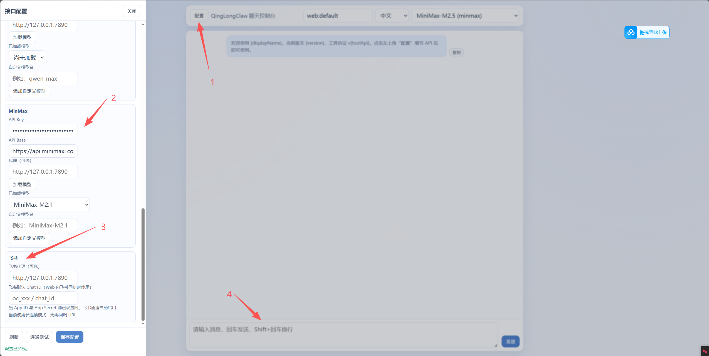
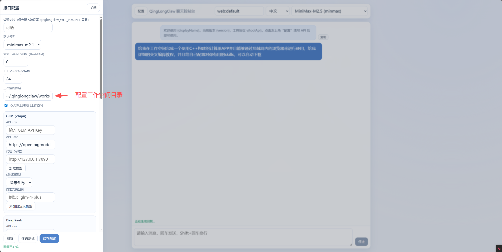
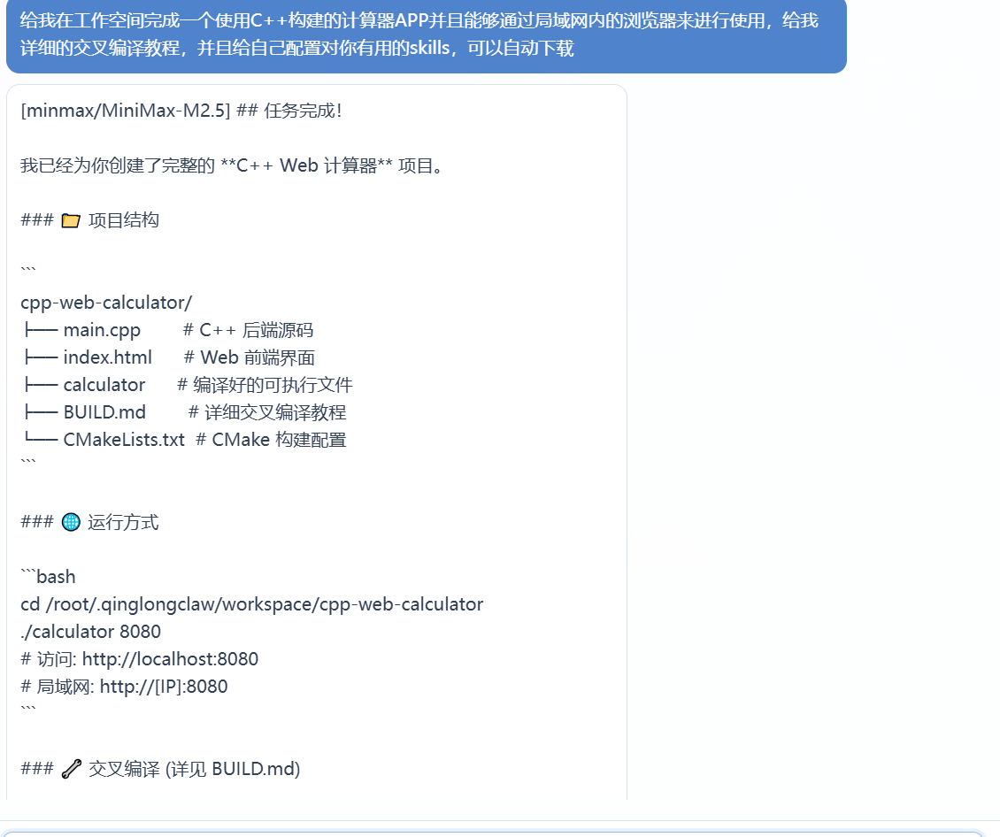

# QingLongClaw

QingLongClaw 是一个基于 C++ 开发的本地任务代理与网关项目，支持通过命令行和 Web 前端进行任务交互。


本项目主可执行文件：
- `qinglongclaw`
- `qinglongclaw-bin`（构建脚本生成的运行入口）

---

## 1. 项目定位

QingLongClaw 面向以下场景：
- 在本地 Linux 或 WSL 环境中运行 AI 任务代理
- 通过浏览器前端统一管理任务与配置
- 在本地工作空间中完成代码/文件自动化任务
- 对接主流模型提供方（GLM / DeepSeek / Qwen / MinMax）

---

## 2. 功能概览

当前版本包含：
- CLI 命令：初始化、状态查询、认证登录、网关启动、技能管理、定时任务
- Gateway 网关服务：默认端口 `18790`
- Web 前端界面：通过网关地址访问
- Skills 目录机制：支持项目过程中沉淀与复用技能
- 本地配置与认证存储：默认位于用户目录

---

## 3. 环境要求

推荐环境：
- Windows 11 + WSL2
- Ubuntu 22.04 x86_64

最低依赖：
- CMake >= 3.18
- GCC/G++ >= 11（推荐 11 以上）
- OpenSSL 开发库
- libcurl 开发库
- Git

---

## 4. 依赖安装（Ubuntu 22.04）

### 4.1 必装依赖

```bash
sudo apt update
sudo apt install -y \
  build-essential \
  cmake \
  ninja-build \
  pkg-config \
  gcc-11 g++-11 \
  libssl-dev \
  libcurl4-openssl-dev \
  git jq unzip zip
```

### 4.2 交叉编译依赖（可选）

如果需要在 x86_64 主机上交叉编译其他架构，请额外安装：

```bash
sudo apt install -y \
  gcc-aarch64-linux-gnu g++-aarch64-linux-gnu \
  gcc-x86-64-linux-gnu g++-x86-64-linux-gnu
```

---

## 5. 从零部署教程（新手可直接照做）

### 步骤 1：进入项目目录

```bash
cd /home/<your-user>/ppx/QingLongClaw
```

### 步骤 2：构建 x86_64（推荐）

```bash
bash ./scripts/build_linux_x86_64.sh
```

### 步骤 3：启动网关

```bash
./qinglongclaw-bin gateway
```

---

## 6. 前端界面访问方式（两种）

网关默认端口：`18790`

### 方式 A：本机访问

- Linux / WSL 内部访问：`http://127.0.0.1:18790/`
- （推荐）Windows 浏览器访问 WSL：`http://localhost:18790/`
- 进入到页面后先进性配置，输入自己的api即可进行聊天，并且可以使用飞书直接链接
- 如何构建飞书的机器人可以B站教学参考：【一次过的openclaw部署与飞书联动打造你的专属机器人】 https://www.bilibili.com/video/BV1TSABz5EZD/?share_source=copy_web&vd_source=90a64e77b9a56f5c9b9f65fd2127f895
### 方式 B：局域网访问
- 打印出主机的局域网IP: 'hostname -I'

- 访问地址：`http://<主机局域网IP>:18790/`

- 需要保证：
  - 网关已启动
  
  - 防火墙已放行 18790 端口
  
  - 访问设备与主机在同一局域网
  
    
  
    
    
    

---

## 7. 其他构建方式

### 编译 Linux aarch64

```bash
bash ./scripts/build_linux_aarch64.sh
```

### 本机自动构建

```bash
bash ./scripts/build_native.sh
```

---

## 8. 常用命令速查

```bash
./qinglongclaw-bin onboard
./qinglongclaw-bin status
./qinglongclaw-bin auth login --provider glm --token <KEY>
./qinglongclaw-bin agent -m "hello"
./qinglongclaw-bin gateway
./qinglongclaw-bin version --detail
```

---

## 9. 开源发布前安全清理

如果要打包或开源，建议先清理本地 API 与认证信息：

```bash
bash ./scripts/sanitize-config.sh
```

默认清理目标：
- `~/.qinglongclaw/config.json`
- `~/.qinglongclaw/auth.json`

---

## 10. 常见问题排查

### Q1：`CMakeCache.txt directory is different`

```bash
rm -rf build build-x86_64 build-aarch64
bash ./scripts/build_linux_x86_64.sh
```

### Q2：前端页面空白

```bash
./qinglongclaw-bin gateway
curl http://127.0.0.1:18790/health
```

返回 `ok` 后刷新浏览器。

### Q3：API 配置后请求失败

请检查：
- API Key 是否有效
- Provider 与模型名是否匹配
- API Base 是否正确
- 网络或代理是否可用
=======
# QingLongClaw
使用C++编辑的简单的claw机器人助手
